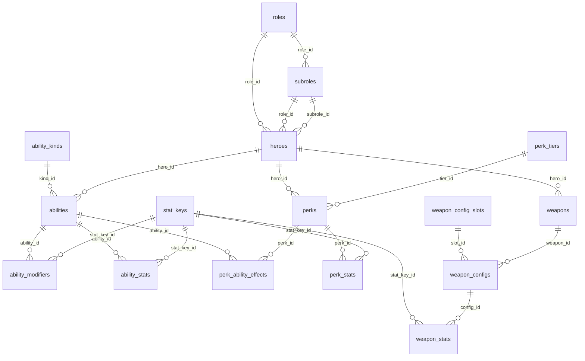
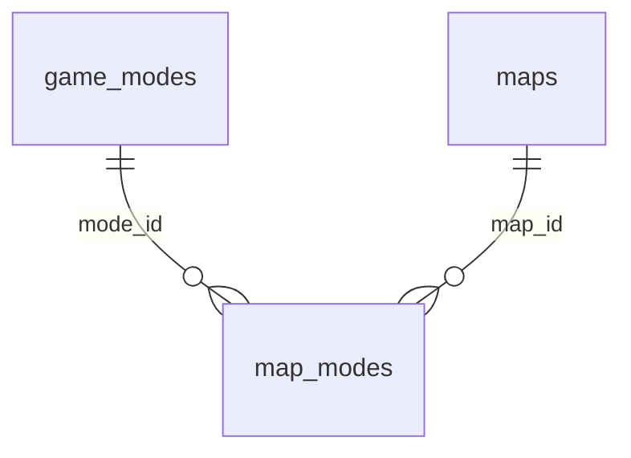
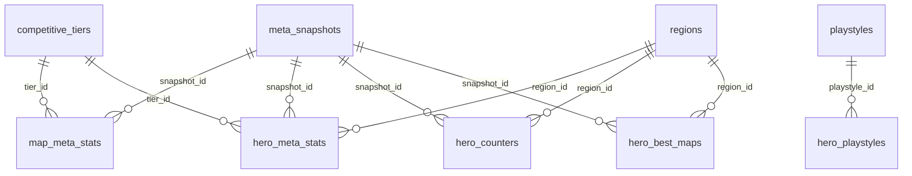
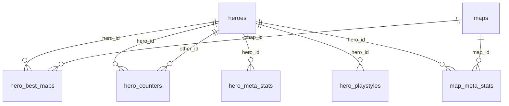

# Entity relationship diagram

The model is three domains that intersect. A counter-pick question is a join
across all three: which hero (HEROES), on which map (MAPS), performing how
well (META).

```
COUNTER = MAX[ HEROES ∩ MAPS ∩ META ]
```

Every table also carries `source_id` → `sources` and a `cao` timestamp. Those
edges are left off the diagram below - they would connect `sources` to all 29
tables and obscure everything else.

## HEROES



## MAPS



## META



## Where the domains join

META and MAPS both hang off HEROES, and `map_meta_stats` is the one table
that reaches all three - a hero's rates on a specific map.


