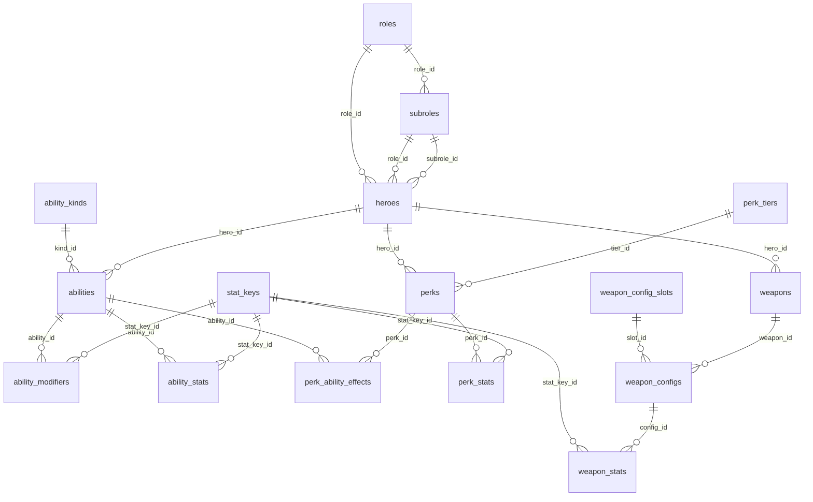
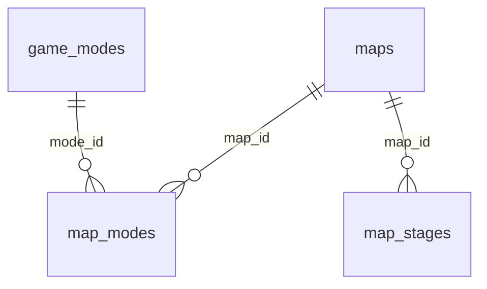
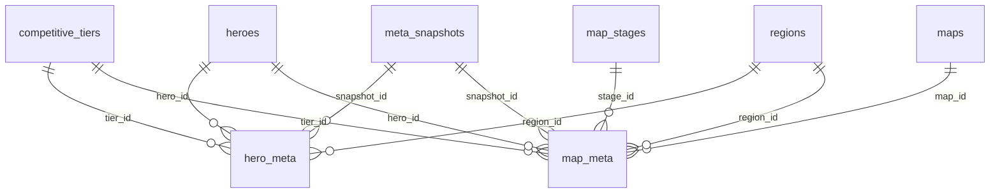
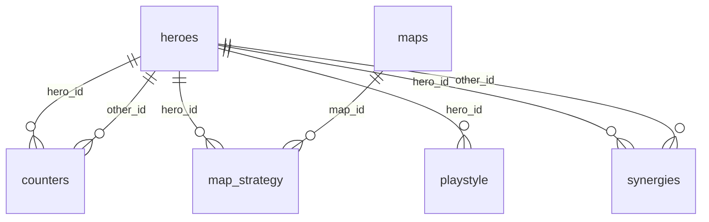

# Entity relationship diagram

The model is domains that intersect. A counter-pick question is a join
across them: which hero (HEROES), on which map (MAPS), performing how well
(META), answering whom and alongside whom (PLAYBOOK).

```
COMPOSITION = MAX[ HEROES ∩ MAPS ∩ META ∩ PLAYBOOK]
```

Each section shows every relationship its tables own, including the ones
that reach into another domain - PLAYBOOK's tables are almost entirely
edges like that, judgements attached to heroes and maps defined elsewhere.

Two tables can be joinable with no edge between them: `hero_meta` and
`map_meta` share four dimension keys (hero, snapshot, tier, region) and
join on any of them - an edge here means a foreign key, and neither owns
the other.

Every table also carries `source_id` → `sources` and a `cao` timestamp. Those
edges are left off - they would connect `sources` to all 30 tables and
obscure everything else.

## HEROES



## MAPS



## META



## PLAYBOOK


